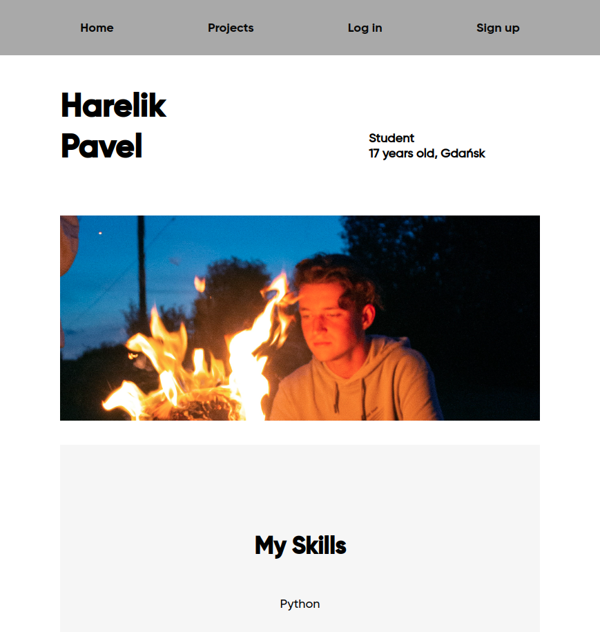
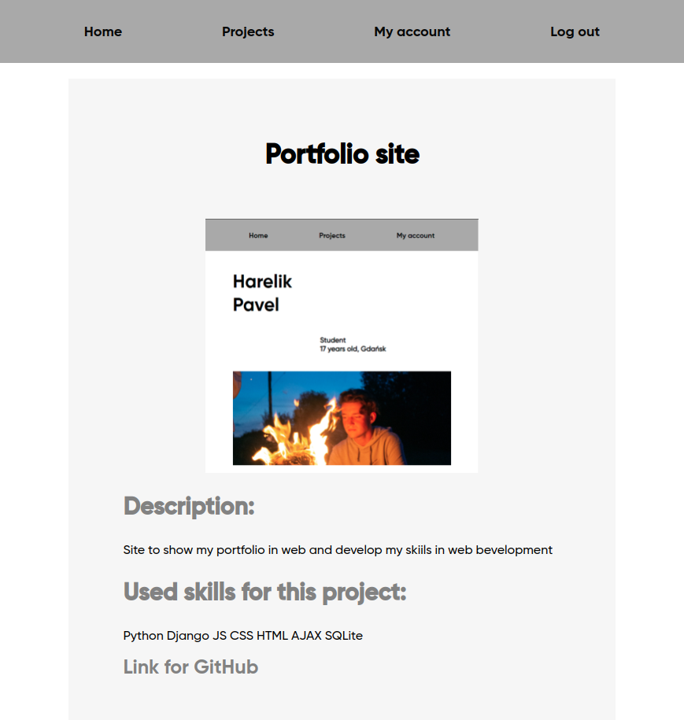

# Portfolio
## Django aplication for portfolio

The main page presents the title of the portfolio.
There is also a page that displays all projects, which can be searched by skills used in them.

As additional applications there are
- Jamboard
- Messenger

In Jamboard application you can save your page to which you can add files or text.
Then you can share this link and thus give access to the content to another person.

The Messenger application allows you to exchange messages between users.
Sending and receiving is realized with the help of AJAX technology.


## Features

Applications are implemented as separate modules and can be easily connected or modded independently from the main application. 

Multilingualism is implemented in the application using i18n and po files


## Installation

To run the application locally you need to bend the repository.
```bash
$ git clone https://github.com/poshkent/my_portfolio_site.git 
$ cd my_portfolio_site
```
Install requirements
```bash
$ python3 -m venv venv
$ source venv/bin/activate
$ pip install -r requirements.txt
```
And run local server
```bash
$ python manage.py runserver
```
Now aplication is ready to use

## Screenshots




